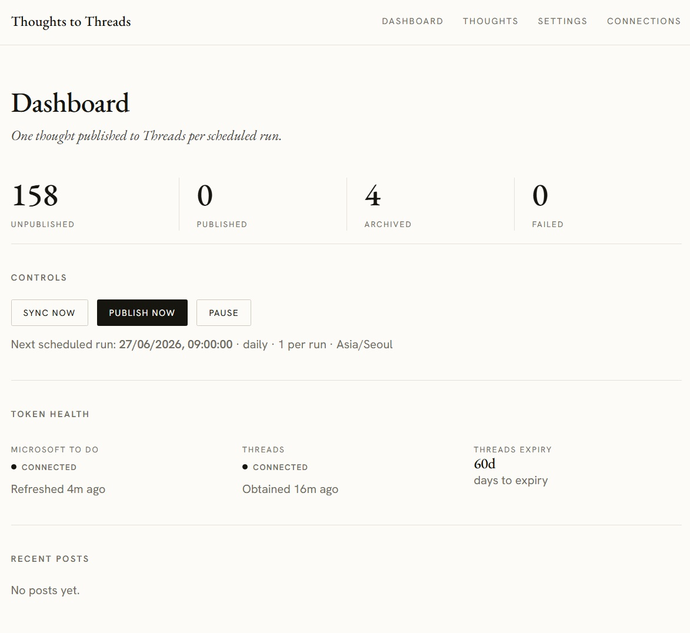

# Thoughts to Threads

A single-user service that pulls "thoughts" from a Microsoft To Do list and
auto-publishes one per day to [Threads](https://www.threads.net), selecting
randomly and never repeating until the pool is exhausted. It ships with a
web dashboard for status, history, manual control, settings, and OAuth connect.

Built with Next.js (App Router) + TypeScript, Firestore (Firebase Admin) for
storage, and Vercel Cron for scheduling. See [`SPECS.md`](./SPECS.md) for the
full design contract.



---

## What it does

1. One-way sync: a Microsoft To Do list -> internal Firestore store.
2. Scheduled daily publish of one randomly chosen, not-yet-published thought to
   Threads.
3. Persistent "no repeat" state with explicit exhaustion behaviour (stop or
   reshuffle).
4. Dashboard: pool stats, post history, manual sync/publish, pause/resume,
   settings, and provider connect flows.
5. Robust token lifecycle for both Microsoft and Threads (the part that breaks
   unattended crons).

### Four behaviours layered on top of the base spec

These extend the base publishing logic and are implemented in the shared, pure
`src/lib/post.ts` so the dashboard preview is always identical to what is
actually published:

1. **Year suffix.** Every published post ends with the thought's year in
   parentheses, e.g. `some thought (2024)`. The year is derived from the To Do
   task `createdDateTime`, computed in the configured timezone (`config.timezone`,
   default `Asia/Seoul`) so dates near a year boundary get the local year. If the
   created date is unknown, the suffix is omitted gracefully.
2. **Multi-thread split.** If the composed content (including the year suffix)
   exceeds 500 characters, it is split into multiple posts published as a reply
   chain on Threads: post 1 is the root, and each subsequent post replies to the
   previous one. The year suffix appears only at the end of the **last** post,
   and a segment is never just the suffix on its own.
3. **Include the note.** The To Do task body/note is included in the post, not
   just the title. Content is composed as the title, a blank line, then the note
   (only when the note is non-empty after stripping HTML and whitespace).
4. **Live preview.** The Thoughts page shows an accurate preview of exactly how
   each post will come out: the same per-post segment array (with year suffix
   and 500-char splits) that will actually be published. Preview equals reality
   because both call the same `buildPreview` / `buildSegments` functions.

---

## Prerequisites

You need three external setups (full step-by-step is in `SPECS.md` section 3):

1. **Microsoft Entra app registration** (personal To Do is delegated-only):
   - Supported account types: Personal Microsoft accounts (or include orgs).
   - Web redirect URI: `{APP_BASE_URL}/api/auth/microsoft/callback`.
   - Client secret -> `MS_CLIENT_SECRET`; Application (client) ID ->
     `MS_CLIENT_ID`.
   - Delegated Graph permissions: `Tasks.ReadWrite`, `offline_access`.
   - Tenant segment: `consumers` (personal-only) or `common` -> `MS_TENANT`.
2. **Meta / Threads app:**
   - Add the Threads use-case; OAuth redirect URI
     `{APP_BASE_URL}/api/auth/threads/callback`.
   - Scopes `threads_basic`, `threads_content_publish`.
   - App ID / Secret -> `THREADS_APP_ID`, `THREADS_APP_SECRET`.
   - Posting to your own account works in development mode (no full App Review
     needed for this single-user tool).
3. **Firebase (Spark plan):** enable Firestore (Native mode); generate a service
   account private key for the Admin SDK (3 env fields). Firebase is storage
   only - no Cloud Functions.

The dashboard (and its API) is gated by a single hard password via HTTP Basic
Auth: set `DASHBOARD_PASSWORD` and the edge middleware requires it for every
request except the cron endpoint and static assets. Any username works — only
the password is checked. Leave `DASHBOARD_PASSWORD` empty to disable the gate
(e.g. local dev).

---

## Environment variables

Copy `.env.example` to `.env.local` for local dev (and set the same values in
your Vercel project for production).

| Variable | Required | Description |
|---|---|---|
| `APP_BASE_URL` | yes | Public base URL of the deployment, no trailing slash. |
| `CRON_SECRET` | yes | Random secret; sent by Vercel Cron as `Authorization: Bearer`. |
| `ENCRYPTION_KEY` | yes | Base64-encoded 32 random bytes for AES-256-GCM token encryption. |
| `MS_CLIENT_ID` | yes | Microsoft Entra application (client) ID. |
| `MS_CLIENT_SECRET` | yes | Microsoft Entra client secret. |
| `MS_TENANT` | yes | `consumers` (personal) or `common`. |
| `MS_REDIRECT_URI` | yes | `{APP_BASE_URL}/api/auth/microsoft/callback`. |
| `THREADS_APP_ID` | yes | Meta/Threads app ID. |
| `THREADS_APP_SECRET` | yes | Meta/Threads app secret. |
| `THREADS_REDIRECT_URI` | yes | `{APP_BASE_URL}/api/auth/threads/callback`. |
| `FIREBASE_PROJECT_ID` | yes | Firebase project ID. |
| `FIREBASE_CLIENT_EMAIL` | yes | Service account client email. |
| `FIREBASE_PRIVATE_KEY` | yes | Service account private key (keep `\n` escaping; unescaped at runtime). |
| `DASHBOARD_PASSWORD` | no | Hard password gating the dashboard + API (HTTP Basic Auth). Empty disables the gate. |
| `NOTIFY_WEBHOOK_URL` | no | Webhook (Slack/Discord) for re-auth / failure alerts. |

Generate an encryption key:

```bash
node -e "console.log(require('crypto').randomBytes(32).toString('base64'))"
```

---

## Local development

```bash
npm install
npm run dev        # http://localhost:3000
```

Notes for local dev:

- The cron endpoint `GET /api/cron/tick` requires
  `Authorization: Bearer ${CRON_SECRET}` even locally:

  ```bash
  curl -H "Authorization: Bearer $CRON_SECRET" http://localhost:3000/api/cron/tick
  ```

- All provider/Firestore clients initialise lazily, so `next build` never needs
  runtime secrets.

Run tests (Node's built-in runner):

```bash
npm test           # node --test
```

---

## Deploy (Vercel)

1. Import the repo into Vercel.
2. Set every required env var (above) in the project settings. Setting
   `CRON_SECRET` makes Vercel attach it to cron calls automatically.
3. Deploy. `vercel.json` registers the daily cron:

   ```json
   { "crons": [ { "path": "/api/cron/tick", "schedule": "0 0 * * *" } ] }
   ```

   Schedule is **UTC**: `0 0 * * *` = 09:00 KST. Adjust to taste.
4. Visit `/connections` and connect Microsoft and Threads. Then pick a source
   list in `/settings`.

---

## How the preview works

The Thoughts page (`/thoughts`) renders the exact post output for each thought.
The data comes from `GET /api/thoughts`, where each thought includes a
`preview: string[]` produced server-side by `buildPreview` in `src/lib/post.ts`.

`buildPreview(t)` = `buildSegments(composeFullText(t), t.year)`:

- `composeFullText` joins the title and (if present) the HTML-stripped note with
  a blank line.
- `buildSegments` appends the year suffix; if the result is <= 500 chars it is a
  single post, otherwise it greedily splits into <= 500-char segments (breaking
  at paragraph, then sentence/space boundaries, hard-splitting over-long
  tokens), reserving room for the suffix on the final segment.

The cron tick publishes using the **same** `buildSegments` call, so the preview
bubbles you see (numbered 1..N, each with a char count out of 500, the year
suffix on the last) are exactly what gets posted. Preview equals reality.

---

## Reliability notes

- **No double-posts on retry.** A multi-post thread persists each published
  media id (`thought.publishedSegmentIds`) as it goes. If a chain fails midway
  (network/5xx/rate limit), the next attempt **resumes** after the last
  successfully published segment instead of re-posting the whole chain. Combined
  with the transactional lock and terminal `published` status, a thought can't be
  posted twice.
- **Last-minute edits are captured at publish time.** Right before a thought is
  posted, `publishOne` re-fetches that exact To Do task
  (`refreshThoughtFromTask`) and publishes the freshest title/note. If the task
  was un-starred, completed, or deleted in To Do since the last sync, it is
  archived and the **next** thought is posted instead. This applies to both the
  cron tick and "Publish now".
- **No live external-edit webhook.** Microsoft Graph change notifications for To
  Do tasks are **not supported for personal Microsoft accounts** (this app uses
  the `consumers` tenant), so the app can't be pushed updates when you edit a
  task. Freshness comes instead from the pre-publish refresh above plus the
  manual **"Refresh from To Do"** button on the Thoughts page (and "Sync now" on
  the dashboard), both backed by `POST /api/actions/sync`.
- **Manual "Publish now" still works when Microsoft is down.** `POST
  /api/actions/publish-now` only requires a healthy Threads connection. It now
  attempts a Microsoft refresh (best-effort) so the pre-publish sync and optional
  write-back can run, but if Microsoft needs re-auth it falls back to the stored
  content and still publishes. The scheduled cron tick keeps the strict behaviour
  (aborts if Microsoft refresh fails).
- **Exhaustion alerts are debounced** (~once per 20h) so a daily cron over an
  empty pool doesn't alert every run; the debounce resets after a successful
  publish.
